This tutorial is designed to walk customers through adding tracing to AWS Lambda functions and monitoring their execution. At the outset, we will have a single APM service dashboard with linked tracing, execution metrics, and logs.


# Architecture

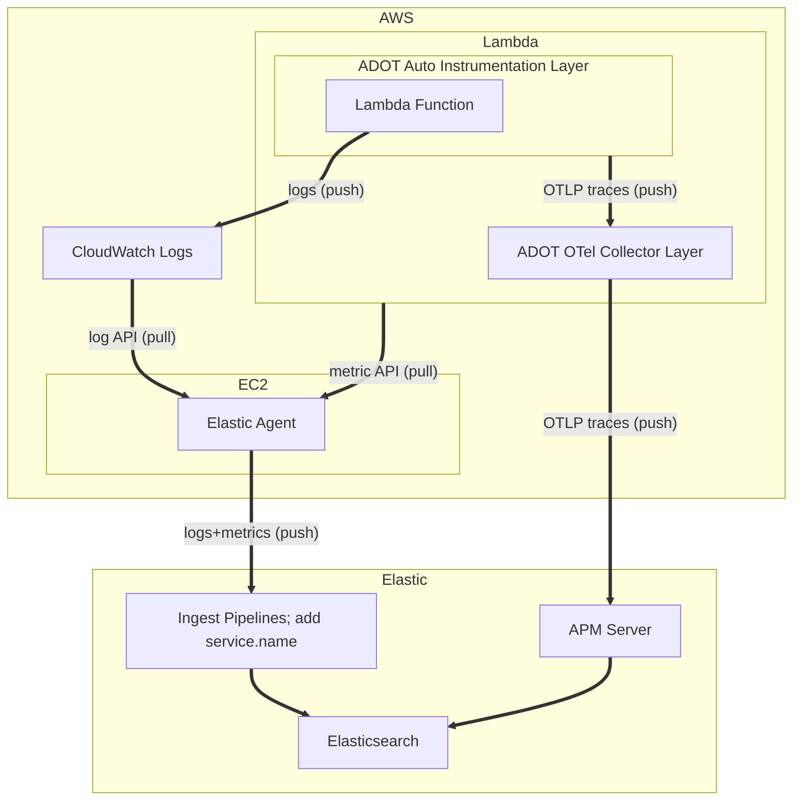

# AWS Lambda Setup 

# Exemplary Code

Select an existing Lambda function, or create a new one. If creating a new Lambda function for exemplary purposes, consider the following code:

```
import json

import json
import boto3
from decimal import Decimal

client = boto3.client('dynamodb')
dynamodb = boto3.resource("dynamodb")

tableName = 'HelloWorld'
table = dynamodb.Table(tableName)

def lambda_handler(event, context):
    print(f"received event: {event}")
    
    body = {}
    statusCode = 200
    headers = {
        "Content-Type": "application/json"
    }
    
    if event['routeKey'] == "GET /":    
        body = 'GET'
    elif event['routeKey'] == "PUT /items":
        requestJSON = json.loads(event['body'])
        table.put_item(
                    Item={
                        'key': requestJSON['id'],
                        'price': Decimal(str(requestJSON['price'])),
                        'name': requestJSON['name']
                    })
        body = 'POST item ' + requestJSON['id']
    
    body = json.dumps(body)
    res = {
        "statusCode": statusCode,
        "headers": {
            "Content-Type": "application/json"
        },
        "body": body
    }
    return res
```

This Lambda function terminates a trivial `GET` and `PUT` RESTful endpoint (themselves hosted by an AWS API Gateway). Further, it demonstrates dependent tracing into AWS DynamoDB.

## Add the ADOT OpenTelemetry layer

In keeping with our best practice to use OTel when available, let's use OTel-based APM! It is well supported for AWS Lambda, and AWS has produced a [singular layer comprising both the Python OTel Agent as well as an OTel Collector](https://aws-otel.github.io/docs/getting-started/lambda/lambda-python). I used [this blog](https://aws.amazon.com/blogs/opensource/auto-instrumenting-a-python-application-with-an-aws-distro-for-opentelemetry-lambda-layer/) for reference.

From your Lambda function page, 

1. Select `Layers` > `Add layer`
2. Select `Choose a layer` > `Specify an ARN`
3. Use ARN `arn:aws:lambda:us-east-2:901920570463:layer:aws-otel-python-amd64-ver-1-24-0:1`
    * you can find the latest release for your target language [here](https://aws-otel.github.io/docs/getting-started/lambda/lambda-python)

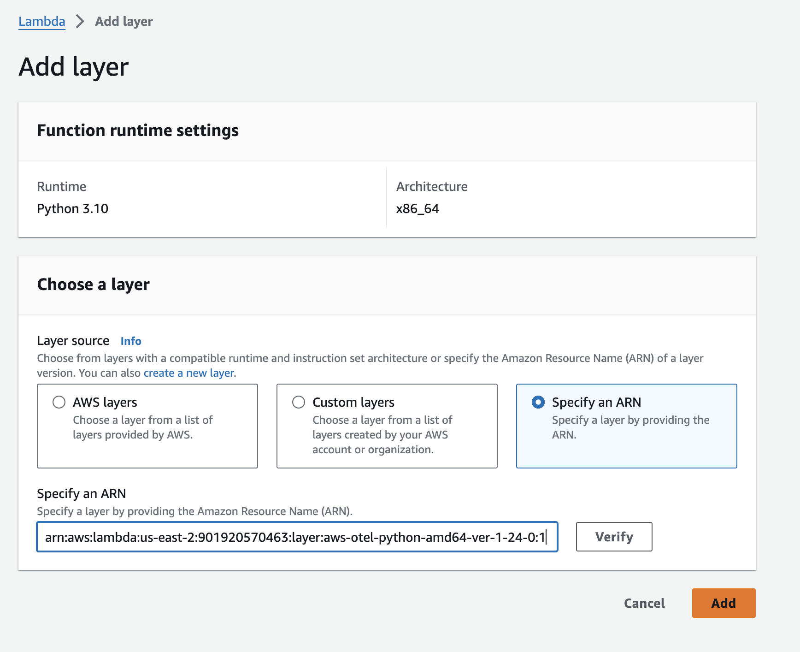

## ENV variables

You will need to set certain environmental variables for your Lambda execution environment:

From your Lambda function page, 

1. Select `Configuration`
2. Select `Environment variables`
3. Select `Edit`

And then select `Add environment variable` for each of the following:

* `AWS_LAMBDA_EXEC_WRAPPER=/opt/otel-instrument`
    * tells Lambda to wrap execution using the OTel auto-instrumentation Agent
* `OPENTELEMETRY_COLLECTOR_CONFIG_FILE=/var/task/collector.yaml`
    * tells ADOT where to find the OTel Collector configuration file (we will be creating this shortly)

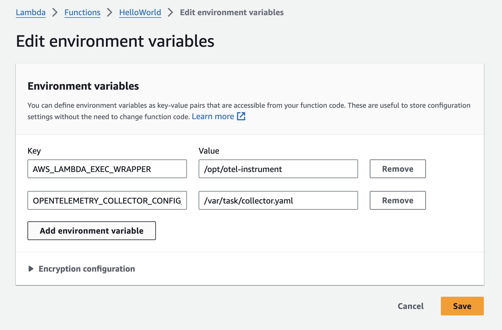

## Configuration

1. Select `Configuration`
2. Select `General configuration`
3. Select `Edit`
4. Set `Timeout` to `9` seconds (to allow ADOT layer time to flush trace data)

* Note: for external tracing, there is no not need to turn on Active Tracing (X-Ray)

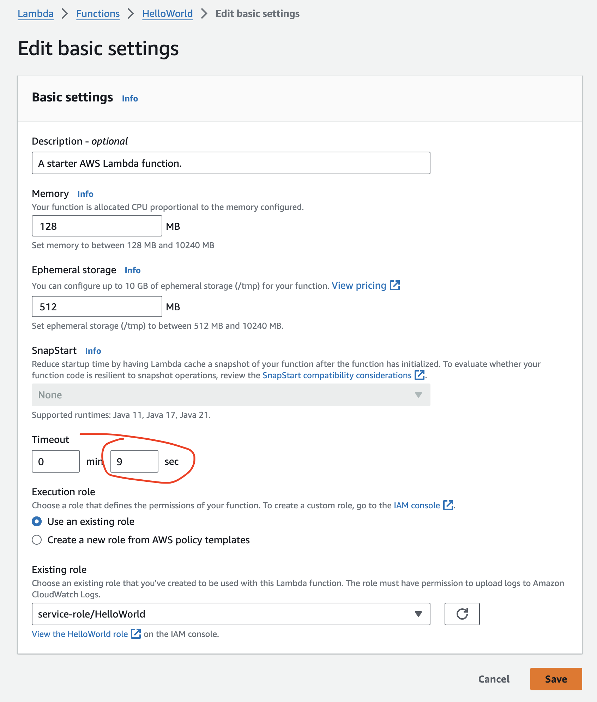

## Collector Configuration

To export OTel telemetry to Elastic, we need to configure the OTel Collector which is part of ADOT. 

### Elastic APM Endpoint

First, you will need to obtain your Elasticsearch endpoint and APM secret token. You can do this by:

1. Login to Elasticsearch/Kibana
2. Navigate to `Observability` > `APM`
3. Select `Add data` (upper right)
4. Select `OpenTelemetry`

From here, make note of the values of:
* `OTEL_EXPORTER_OTLP_ENDPOINT`
* `OTEL_EXPORTER_OTLP_HEADERS`

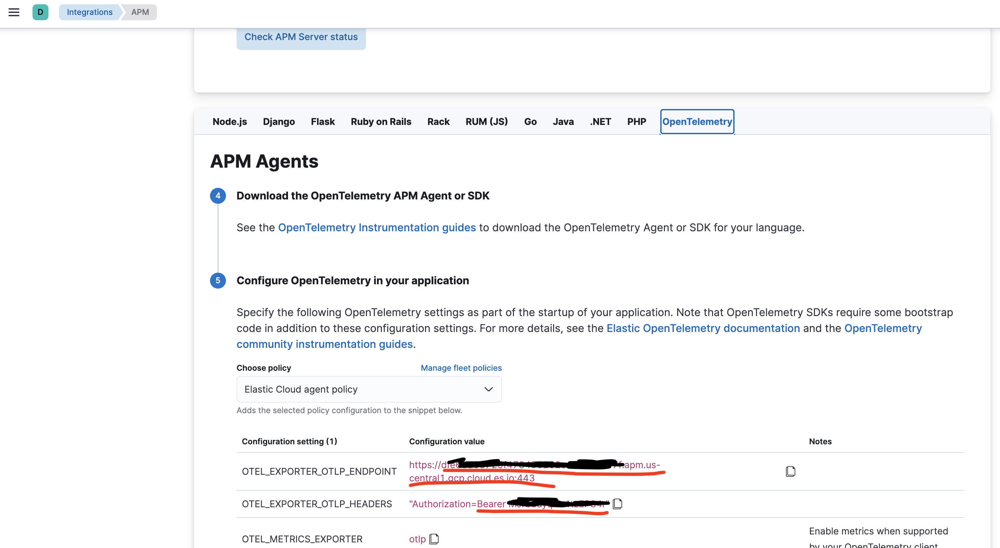

### collector.yaml

We now need to create an OTel Collector configuration file in AWS Lambda. 

1. Select `Code` (You should be in the directory of your Lambda function)
2. Select Menu `File` > `New File`

Paste the following into the editor:

```
# collector.yaml in the root directory
# Set an environemnt variable 'OPENTELEMETRY_COLLECTOR_CONFIG_FILE' to
# '/var/task/collector.yaml'

receivers:
  otlp:
    protocols:
      grpc:
      http:

exporters:
  logging:
    verbosity: detailed 
  otlp/elastic: 
    # Elastic APM server https endpoint without the "https://" prefix
    endpoint: "abc123.apm.us-central1.gcp.cloud.es.io:443"  
    headers:
      # Elastic APM Server secret token
      Authorization: "Bearer xyz123"  

service:
  pipelines:
    traces:
      receivers: [otlp]
      exporters: [otlp/elastic]
    metrics:
      receivers: [otlp]
      exporters: [otlp/elastic]
    logs: 
      receivers: [otlp]
      exporters: [otlp/elastic]
```

* where `endpoint:` should be the value of `OTEL_EXPORTER_OTLP_ENDPOINT` (copied above), but **WITHOUT** the `https://` prefix
* where `headers/Authorization:` should be the `Bearer xyz123` portion of `OTEL_EXPORTER_OTLP_HEADERS` (copied above); do not include `Authorization=`

Now save the file:
1) Select Menu `File` > `Save`
2) Name the file `collector.yaml`

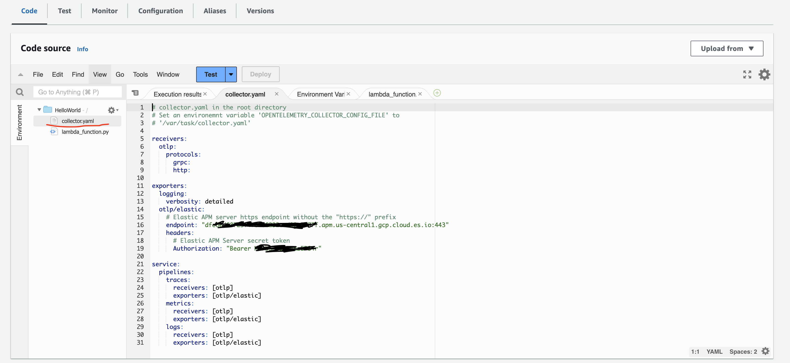

# Setup Elastic

To export Lambda metrics (and metrics from other supporting services, like API Gateway), we will need an Elastic Agent. The Agent needn't run within AWS/EC2, although doing so allows you to use IAM authentication rather than API secrets.

## EC2

Create an appropriately sized EC2 instance to host Elastic Agent. Depending on the volume of data, you can use anything from an `e2.micro` on up. For this PoC, I used a `t2.small` instance.

## Deploy and Enroll Agent

1) Select `Management` > `Fleet`
2) Select `Add agent`
3) Select `Create a new agent policy`
4) Name it `AWS`
5) Select `Create policy`
6) Select `Enroll in Fleet (recommended)`
7) Select `Linux Tar`
8) SSH into your EC2 instance
9) Copy/paste the commands to install Elastic Agent
10) Wait for `Confirm agent enrollment` to confirm telemetry reception

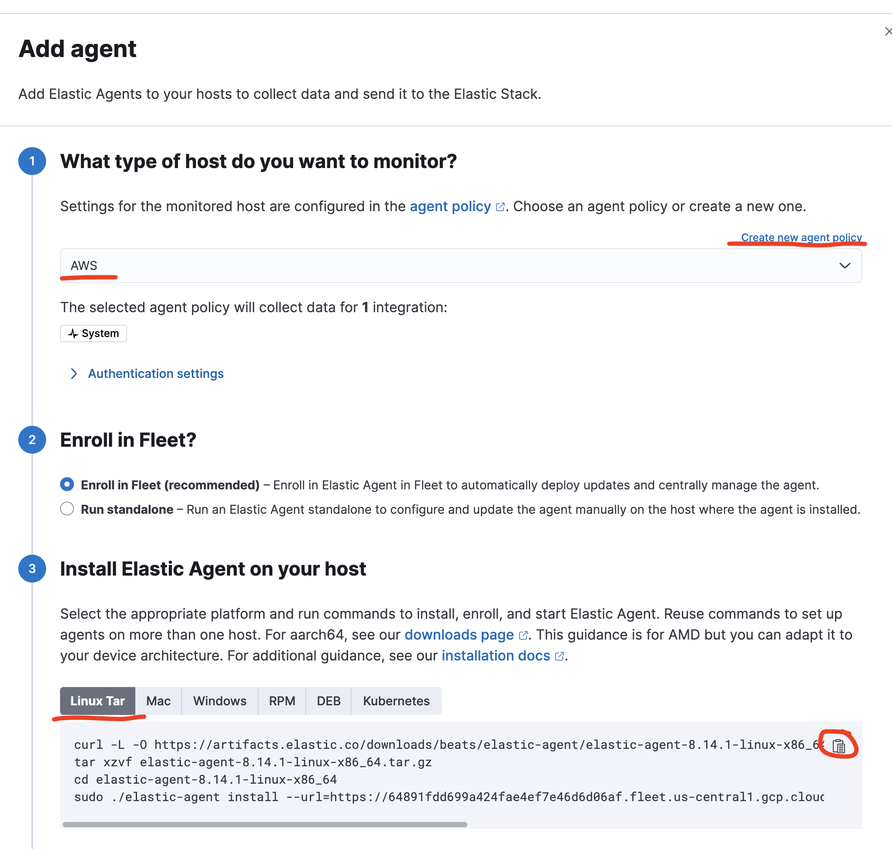

## Add AWS Integration

1) Select `Management` > `Integrations`
2) Search for integrations > `AWS`
3) Select `AWS`
4) Select `Add AWS`

### Permissions

Use appropriately configured IAM for your EC2 instance or create an `Access Key ID` and `Secret Access Key` from your AWS Profile. See [here](https://www.elastic.co/docs/current/integrations/aws) for more information.

If you are configuring for a AWS Access Key, select `Third-party service` as the `Use case`

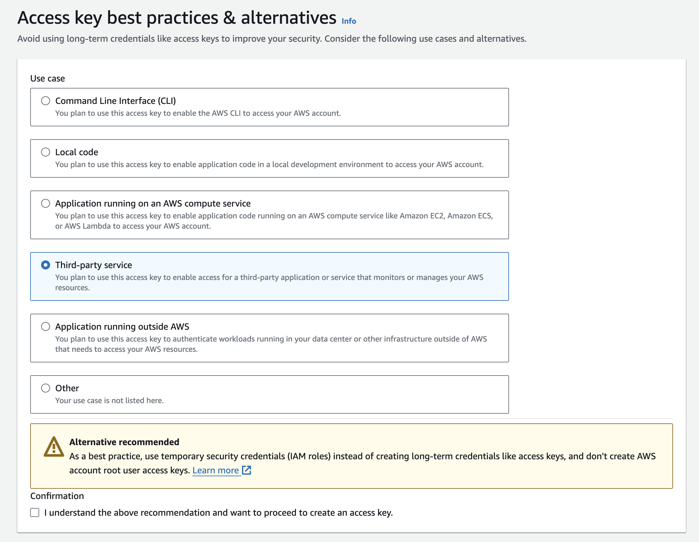

### Features

Enable collection of at least:
* `Collect logs from CloudWatch`
    1. Expand `Change defaults`
    2. Here, I'm looking to just collect Lambda logs, so set `Log Group Name Prefix` to `/aws/lambda/`. You will also then need to set the region this Lambda is running in; for me, that's `Region Name` set to `us-east-2`. You could also collect by Log Group ARN.
    3. Set `Dataset name` = `aws.cloudwatch_logs` 

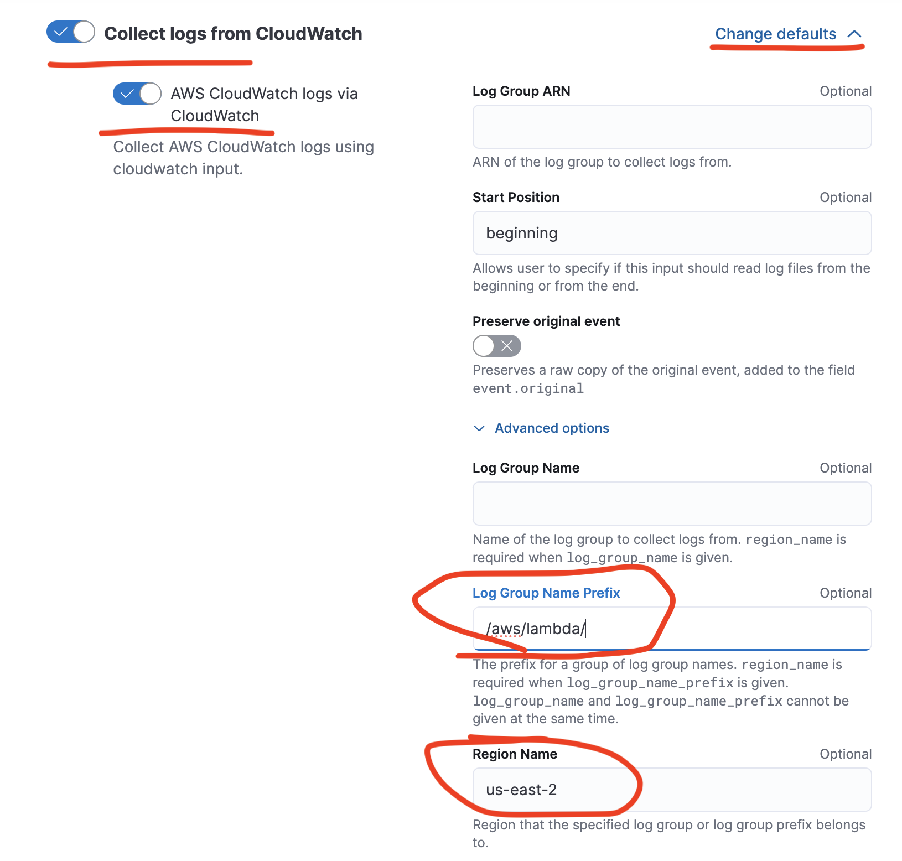
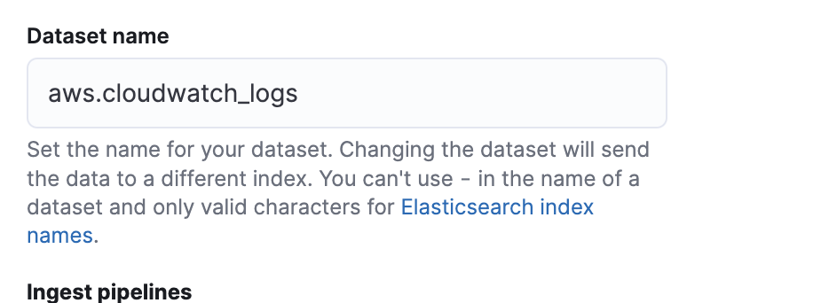

* `Collect Lambda metrics`

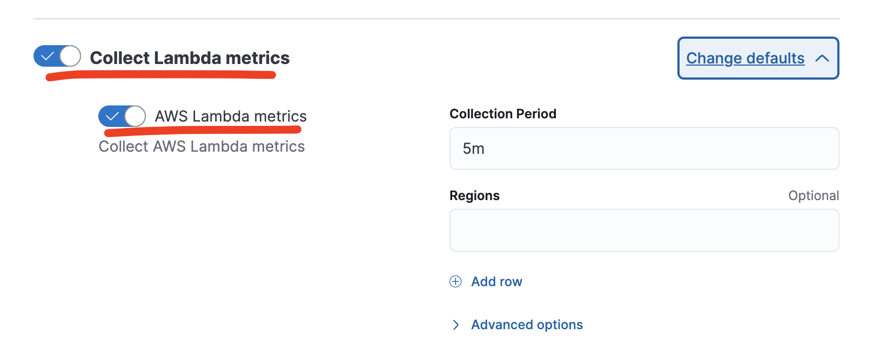

and potentially disable all other features (for now)

### Ingest pipelines

To allow correlation of Lambda logs from Cloudwatch and Lambda metrics into the APM UX, we need to ensure `service.name` is set appropriately. We can do this using Elastic Ingest Pipelines.

You can create Ingest Pipelines using our UI (`Management` > `Stack Management` > `Ingest Pipelines`) or via API using DevTools. Since we are simply deploying pipelines I've already developed, I would suggest using DevTools (`Management` > `DevTools`).

### logs-aws.cloudwatch_logs@custom

This pipeline will extract the service name from the `awscloudwatch.log_group` and save it to a new field `service.name`.

```
PUT _ingest/pipeline/logs-aws.cloudwatch_logs@custom
{
  "processors": [
    {
      "dissect": {
        "field": "awscloudwatch.log_group",
        "pattern": "/aws/lambda/%{service.name}",
        "ignore_missing": true,
        "ignore_failure": true
      }
    }
  ]
}
```

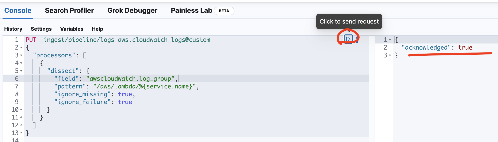

### metrics-aws.lambda@custom

This pipeline will extract the service name from the `aws.dimensions.FunctionName` and save it to a new field `service.name`.

```
PUT _ingest/pipeline/metrics-aws.lambda@custom
{
  "processors": [
    {
      "set": {
        "field": "service.name",
        "copy_from": "aws.dimensions.FunctionName",
        "ignore_failure": true
      }
    }
  ]
}
```

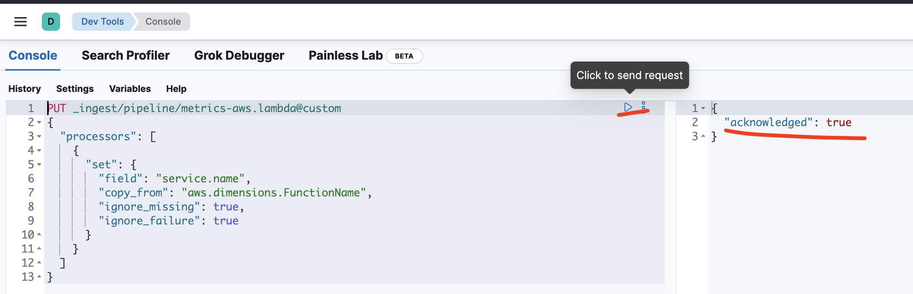

## APM Service Dashboard Linkage

Exercise your Lambda using a test or a real REST (via API Gateway) call in order to generate some exemplary data into Elasticsearch.

1) Find your Lambda service in Elastic APM (`Observability` > `APM`)
2) Select Lambda service
3) Select `Dashboards` tab
4) Select `Link dashboard`
5) Select dashboard `[Metrics AWS] Lambda Overview`
    * `Filter by service and environment` enabled

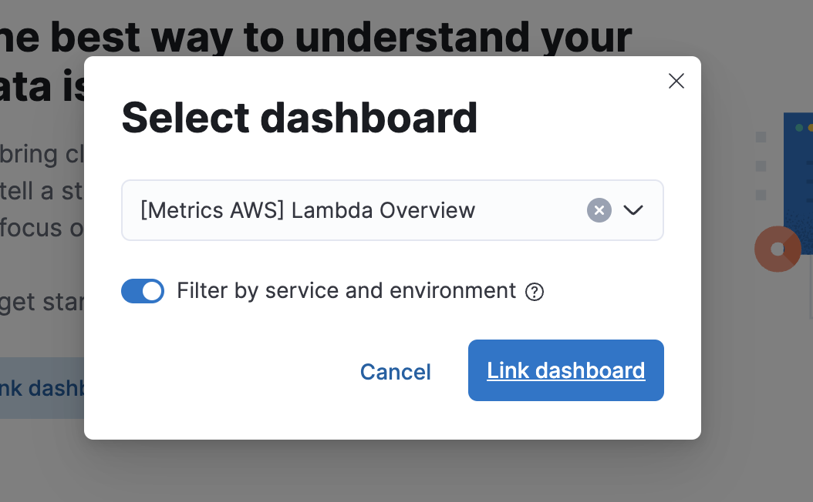

# Explore!

Exercise your Lambda through RESTful calls.

* `Logs` in the APM UX links to your Lambda logs (coming via CloudWatch > Elastic Agent)
* `Dashboards` links to your Lambda metrics (you could create a custom dashboard which potentially includes elements of AWS Lambda metrics, API Gateway metrics, and Elastic Synthetics metrics)
* `Transactions` will show transactions into your `lambda_function.lambda_handler`
    * note `GET` and `PUT` transactions are coupled together since they are handled by a singular Python entry point
    * note that tracing extends into our dependencies (in this example, DynamoDB); if you call into other instrumented functions, you will see distributed traces into those functions as well

